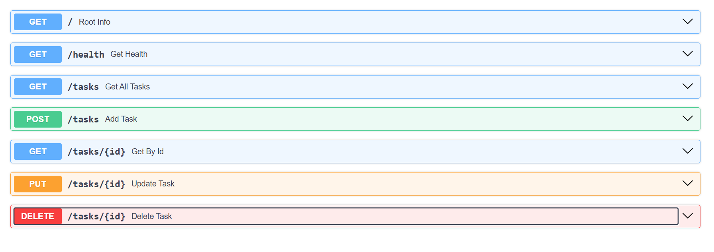

# FASTAPI SERVER FOR TASK APP

## How to use it?

- Download these files on your PC
- Create and activate a virtual environment (optional)
    - In your terminal, run:
        - python -m venv venv
        - venv/Scripts/activate
- Install FastAPI and other libraries (must)
    -In your terminal, run:
        - pip install fastapi[standard]
- Run the server using the command in your terminal:
    - fastapi dev
- Now, you can run the curl commands to use the app, or you can open http://127.0.0.1:8000/ in your browser
- Example curl command: curl "http://127.0.0.1:8000/tasks/101"
- You can also access the Swagger UI made interactive documentation, on http://127.0.0.1:8000/docs

## What is ths app about?

This is a task managing CRUD app to manage your daily tasks efficiently. It consists of  endpoints.

## Table for Endpoints

| Endpoint | Description | Parameters | Response |
| :--- | :--- | :--- | :--- |
| `GET /` | Welcome the user | *None* | `{"name": str, "version": str, "endpoints": list}` |
| `GET /health` | Check if server is working | *None* | `{"status": "ok"}` |
| `GET /tasks` | Display all the tasks stored in the app | *None* | `List[Task]` |
| `GET /tasks/{id}` | Display the task based on ID | **Path:** `id` *(int)* | `Task` or `404 Not Found` |
| `POST /tasks` | Add a new task to the app | **Body:** `{"title": str}` | `Task` *(201 Created)* or `400 Bad Request` |
| `PUT /tasks/{id}` | Update the existing tasking based on ID | **Path:** `id` *(int)* **Body:** `{"title"?: str, "done"?: bool}` | `Task` or `400 Bad Request` / `404 Not Found` |
| `DELETE /tasks/{id}` | Remove a task from app based on ID | **Path:** `id` *(int)* | *204 No Content* or `404 Not Found` |

## Screenshot of Endpoints in Swagger UI Documentation

## AI vs Me

### My Prompt

"i want you to create a fastapi app which include 7 endpoints

you have to use http responses where needed in code

initially created a list of dictionaries that will hold the task data
there should be 3 already made tasks in the app
each task should have an id (integer), a title(string), done (bool)

first endpoint should be a get method that just responds with the app name, version and paths it is going to use

second endpoint should be a get method with path /health and it should respond with status : ok in json format

3rd endpoint should be get method and have the path /tasks and it should respond with all the tasks in json format

4th endpoint should be get method and have the path /tasks/{id} and it should take an id as a parameter and it should respond with details of only one task according to id in json format  if the id doesnt exist raise a http exception

5th endpoint should be a post method and it should have path /tasks and take a json body as parameter with only the title. you have to assign the id that is greater than the ids of existing tasks, you should set its "done" to false. you have to make sure the title should not be empty or missing. if the data is posted give 201 response and if the data is missing give bad request response

6th endpoint should be a put method and it should have path /tasks and take json body  and an id as a parameter. the user should allowed to update the data of already existing task. you have to make sure that the body is not empty or the id is not available. if id is not available give 404 response, if json body is not acceptable then give bad request response

7th endpoint should a delete method with path /tasks and take an id as parameter. it should be delete the task and give 204 response. if the id doesnt exist then give 404 response"

### 3 differences

- AI used the pydantic model to set default values and to the validation checks
- AI's PUT method will allow us it change both "title" and "done" and even just one of these
- AI used the status codes for every endpoints, even where i missed
